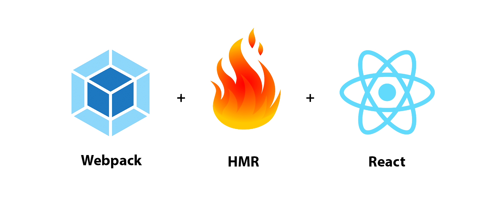

本專案為[React Webpack HMR 快速入門](https://medium.com/@heyfinn/react-webpack-hmr-example-7a4e462fb7f)的範例專案。



# React Webpack HMR 快速入門
「工欲善其事，必先利其器」，對於開發網站來說，一開始的環境建置是既麻煩、卻又重要的工作。隨著開源社群的正面網絡效應擴大，網站的開發也跟著快速更新，尤其是前端開發。

其中 **HMR(Hot Module Replacement)** 是我最喜歡的開發環境功能，它允許任何設定好的文件一但更改，元件便立即更換、不整頁刷新。

我們主要需要用到的工具是：**webpack 3**。

## Webpack 設定
Webpack 是一個模組打包工具，比以前前端常用的 gulp 還要強大。

套用 webpack 中文社群的翻譯介紹：
> 本質上，webpack 是一個現代 JavaScript 應用程序的靜態模塊打包器(module bundler)。當 webpack 處理應用程序時，它會遞歸地構建一個依賴關係圖(dependency graph)，其中包含應用程序需要的每個模塊，然後將所有這些模塊打包成一個或多個 bundle。

和以往的開發比較(未使用打包工具)， webpack 讓我們得已統一管理所有靜態資源(包括 js, css, scss, png, svg, etc)，減少程式碼的全域污染，透過模組化程式碼讓開發更方便(e.g. HMR)。
### 實作 Webpack 打包
webpack 的主要概念如下(也是我們在 config 裡要設定的參數)：
* **entry**: 待打包的 source 從哪裡來
* **output**: 打包完要匯出到哪
* **loader**: 將 webpack 看不懂的檔案轉成 webpack 看的懂 js
* **plugin**: 使用什麼套件來處理這些檔案

→ set **entry** of sources
→ use **loader** to transform to webpack-readable js
→ use **plugins** to process to vanilla js
→ bundle then **output**

當我們想要實作 Webpack HMR，我們需要告知 webpack 我們的 source 在哪裡(entry)、打包完匯出到哪(output)、針對不同檔案要怎麼處理(loader)、以及要怎麼處理這些檔案(plugin)。配合下圖理解，效果更優。


實作的第一步，我們得先安裝 webpack:
```
yarn add -D webpack
```

### webpack.config.js
想要使用 webpack，必須得熟悉 webpack 的設定檔，我們先建立一個 `webpack.config.js`。

```
const path = require('path')
function resolve (dir) {
  return path.join(__dirname, '..', 'dir')
}
module.exports = {
  // Entrance of our source code
  entry: './src/index.js',
  // Exit of our code processed and bundled
  output: {
    filename: '[name].bundle.js',
    path: resolve('dist'),
  },
  // about kinds of code requesting for being processed
  module: {
    rules: [
      {
        test: /(\.js$|\.jsx$)/,
        loader: 'babel-loader',
        exclude: /(node_modules|bower_components)/,
        include: [resolve('src')]
      }
    ]
  },
  // plugins we used to transform or working on
  plugins: [
    ...
  ]
}
```

這個設定檔說，要求 webpack 讀取 `./src/index.js`，打跑處理完後放到 dist資料夾，針對 `.js` 及 `.jsx` 檔使用 `babel-loader` 來辨識轉換成 es5 js。
因此我們需要安裝 `babel-loader` 以及 `babel-core` (也就是 babel 本體)：

```
yarn add -D babel-loader babel-core
```

### babel
Babel 是目前最常用的 js compiler，它的用途顧名思義，可以將 js 轉換成現在大部分瀏覽器可以看得懂的 js。比如前端近年來用之習慣的 es6/es7 語法，都可以使用它順利轉換成 general codes。

```
// es6 syntax
let path = ''
const resolve = dir => path.join('..', dir)
// es5 result compiled by Babel
'use strict';
var path = '';
var resolve = function resolve(dir) {
 return path.join('..', dir);
};
```

我們可以透過專案目錄下 `.babelrc` 設定要把 js code 兼容到「多老」，或是符合某種規範。為完成我們的範例，我們需要至少擁有以下基本設定：

```
{
  "presets": [
    "react"
  ],
  "plugins": [
    "transform-react-jsx"
  ],
  "env": {
    "development": {
      "presets": ["react-hmre"]
    }
  }
}
```

處理到這裡，我們已經可以用 webpack 指令讓目標 js 順利 compile 成 bundle 檔了：
```
webpack --config build/webpack.config.js
```


### 開發中介層(middleware)
在使用 server 上我們有兩個選項：
* webpack-dev-server
* webpack-dev-middleware + express

#### webpack-dev-middleware
要實現 HMR，我們必須在 serve 靜態檔案的 server 上，包一層 middleware 來監聽改變、動態換掉檔案，而這一層就是 webpack-dev-middleware。
####  webpack-dev-server
webpack-dev-server 除了有基本的 server 功能，還包含了 webpack-dev-middle-ware，安裝起來相對單純，但就缺少了 server 的使用彈性。


我們使用 express + middleware 來嘗試，順便一起安裝 hot 套件：

```
yarn add express
yarn add -D webpack-dev-middleware webpack-hot-middleware
```
 再來設定 express server.js，並在 webpack.config.js 加上 plugins(請看 project source code)

```
// HMR plugins
new webpack.HotModuleReplacementPlugin(),
new webpack.NoEmitOnErrorsPlugin()
```
Webpack HMR 基本上已經可以運作了，為了讓我們可以在視覺上體驗它的效果，讓我們加入 React 來試試！

# React 加進來
## 安裝使用套件
先怒加一發 React 及其開發相關套件：
```
yarn add react react-dom
yarn add -D babel-preset-react babel-plugin-transform-react-jsx
```
React HMR 套件 react-hot-loader：
```
yarn add -D react-hot-loader
```
以及 html 及其他處理套件，清空 dist、創造 index.html：
```
yarn add -D clean-webpack-plugin html-webpack-plugin
```

### 套件說明
#### babel-preset-react, babel-plugin-transform-react-jsx
告知 babel 我們要寫 React，請支援 React 及 JSX 語法

#### react-hot-loader
支援 React 元件 HMR，以前也有人使用的 [react-transform-hmr] 已經停止開發，現在最多人使用的是 react-hot-loader。概念是在網站 root component 最外面包一層，若有 hot reload 的需要，就直接 re-render。

#### clean-webpack-plugin
用來清空最終匯出資料夾 e.g. 清空dist
#### html-webpack-plugin
客製化創造網頁主模板 index.html

## Hello World 範例
試著寫個簡單的 hello world component：


再把 hello-world component 引進來：


Done!
### 範例專案架構

```
react-hmr-example
├── build
|   └── webpack.config.js
├── dist
├── node_modules
├── src
|   ├── HelloWorld.jsx
|   └── index.js
├── .babelrc
├── .gitignore
├── index.html
├── package.json
├── README.md
├── server.js
└── yarn.lock

```

# Reference
* 各種軟件們的官方網站
* https://segmentfault.com/a/1190000005614604